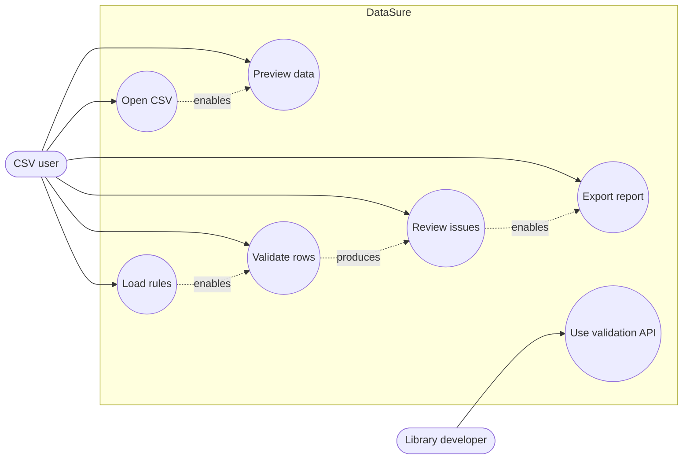
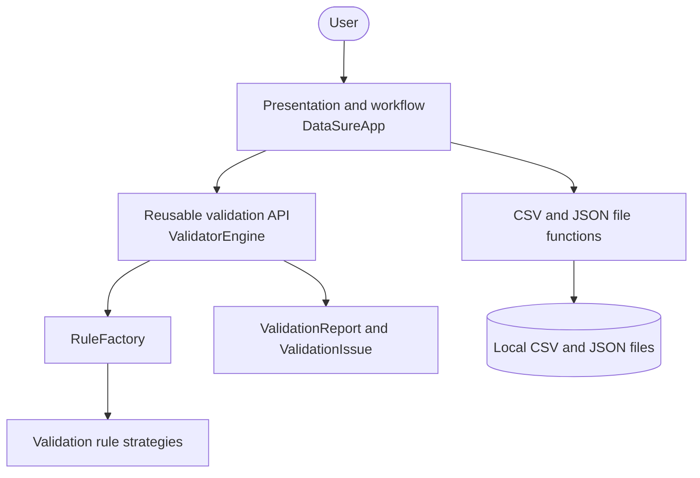
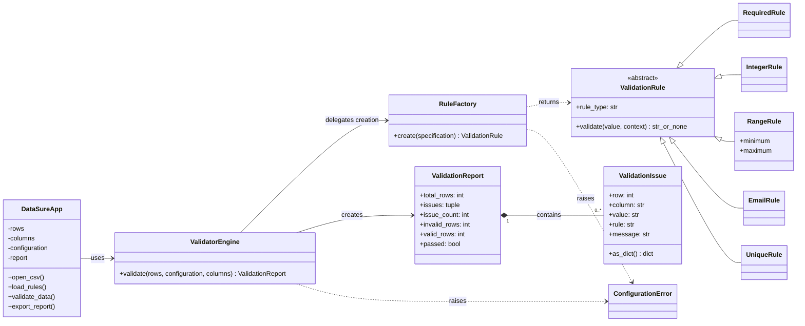
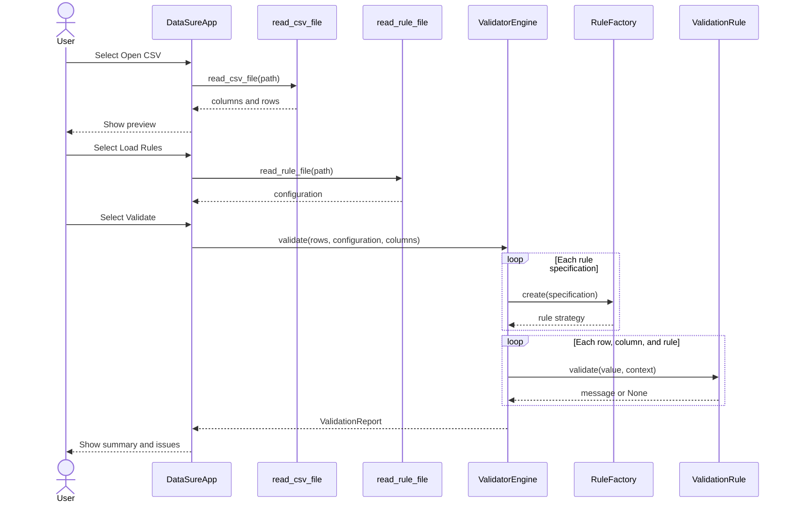
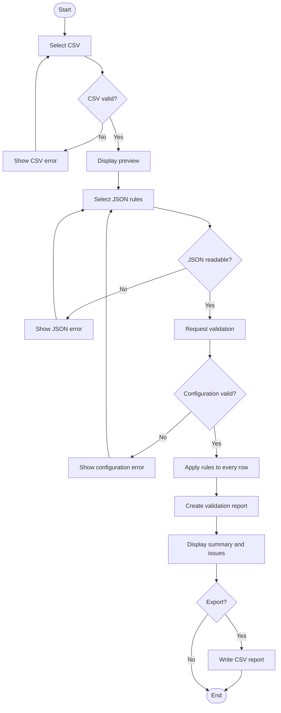

# DataSure Design Documentation

## 1. Problem, purpose, and intended users

CSV data is easy to exchange but frequently contains missing, mistyped,
out-of-range, incorrectly formatted, or duplicate values. Finding these
problems manually is slow and inconsistent. DataSure gives a non-technical
user a small desktop workflow for previewing a CSV file, applying explicit
rules, locating failures, and exporting a reviewable report.

The intended users are students, administrators, and small teams that receive
CSV files and need a repeatable quality check without changing the source data.

## 2. Scope

### Included

- CSV selection and preview.
- JSON rule loading.
- Required, integer, range, email, and unique validation.
- Row-level issue and summary display.
- CSV issue-report export.
- User-friendly file and configuration errors.
- An independently reusable validation module.

### Excluded

- Data editing or automatic correction.
- A visual rule editor.
- Excel, databases, remote services, authentication, charts, and installers.
- Full RFC email verification.

This boundary provides enough behaviour to demonstrate requirements,
modelling, architecture, patterns, implementation, testing, and reuse without
introducing features unrelated to the assessed problem.

## 3. Team introduction and responsibilities

The brief is titled *Individual Project*, so this artefact currently assumes
one student. Replace the placeholders after confirming the assessment format.

| Member | Role | Responsibilities |
|---|---|---|
| **ADD NAME AND ID** | Analyst, designer, developer, tester, documenter | Requirements, UML, architecture, implementation, tests, report, and demonstration |

If the tutor confirms pair work, add the second member and state both members'
technical and documentation contributions. The repository history must then
show commits from both accounts.

## 4. Project plan

| Stage | Work | Evidence | Status |
|---|---|---|---|
| 1. Scope | Define users, problem, boundary, and acceptance conditions | Sections 1–2 | Complete |
| 2. Requirements | Write stories, requirements, and specifications | Sections 5–8 | Complete |
| 3. Model | Create wireframe, architecture, and UML | Sections 9–12 | Complete |
| 4. Library | Implement rules, factory, engine, and result models | `datasure_core.py` | Complete |
| 5. Desktop app | Implement loading, preview, results, and export | `app.py` | Complete |
| 6. Verification | Run automated and GUI smoke tests | Section 15 | Automated checks complete |
| 7. Submission | Capture screenshots, report, video, URLs, and final clean-clone check | Report and external links | Student action required |

The implementation is divided into small, verifiable increments. Git records
should be committed at the end of each stage rather than as one final commit.

## 5. Requirements elicitation

### User stories and acceptance conditions

| ID | User story | Acceptance condition |
|---|---|---|
| US-01 | As a user, I want to open a CSV file so that I can inspect its records. | A valid file is loaded and its name and contents are shown. |
| US-02 | As a user, I want to load rules so that valid data is explicitly defined. | A JSON object can be selected and retained for validation. |
| US-03 | As a user, I want every record checked so that data problems are identified consistently. | All loaded records are passed to the reusable engine. |
| US-04 | As a user, I want row-specific messages so that I can locate each problem. | Every issue includes the physical row, column, value, rule, and message. |
| US-05 | As a user, I want to export findings so that they can be shared or retained. | The displayed issues can be saved as a UTF-8 CSV report. |
| US-06 | As a developer, I want validation to work without the GUI so that it can be reused. | A Python caller can import and run `ValidatorEngine` without importing Tkinter. |

### Functional requirements

| ID | Requirement |
|---|---|
| FR-01 | The system shall let the user select and load a UTF-8 CSV file. |
| FR-02 | The system shall show the CSV headers and up to the first 100 data rows. |
| FR-03 | The system shall load a non-empty rule configuration from JSON. |
| FR-04 | The system shall validate every loaded row using the reusable library. |
| FR-05 | The system shall support required, integer, range, email, and unique rules. |
| FR-06 | Every issue shall identify its physical CSV row, column, value, rule, and message. |
| FR-07 | The system shall show total, valid, and invalid rows and the issue count. |
| FR-08 | The system shall export the current issue list as CSV. |
| FR-09 | The system shall report file and configuration errors without terminating unexpectedly. |
| FR-10 | The validation library shall operate independently from the desktop interface. |

### Non-functional requirements

| ID | Requirement | Verification |
|---|---|---|
| NFR-01 | Validation shall not modify the source file or input row objects. | Automated immutability test and file comparison. |
| NFR-02 | All reusable-library behaviour shall be automatically tested. | `python -m unittest -v`. |
| NFR-03 | New rule algorithms shall be addable through one common rule interface. | Class design and code review. |
| NFR-04 | The core library shall not import Tkinter or perform file I/O. | Import and source inspection. |
| NFR-05 | Validation failures shall contain enough context to locate the source value. | Automated row/column test and GUI inspection. |
| NFR-06 | The program shall run with a standard Python installation containing Tkinter. | Clean-environment run with no package installation. |

## 6. Use cases



### Main use case: validate a CSV file

| Field | Specification |
|---|---|
| Primary actor | CSV user |
| Preconditions | Application is running; readable CSV and JSON files exist. |
| Trigger | User selects **Validate**. |
| Main flow | Open CSV → preview data → load rules → validate all rows → show summary and issues. |
| Alternative flow | A malformed file or configuration produces a clear dialog and no crash. |
| Postconditions | A `ValidationReport` exists and export is enabled. |

## 7. Refinement and feature specifications

### FS-01: Open and preview CSV

- **Input:** Path selected through the Open dialog.
- **Processing:** Decode UTF-8, read headers, reject blank or duplicate headers,
  reject extra fields, and store rows without altering the file.
- **Output:** Filename, headers, row count, and up to 100 preview rows.
- **Failure:** An explanatory dialog is shown and previous valid state remains.
- **Acceptance:** `sample_students.csv` displays four data rows and four columns.

### FS-02: Load rules

- **Input:** Path to a JSON file.
- **Processing:** Decode JSON and require a non-empty object whose keys identify
  columns and whose values contain rule specifications.
- **Output:** Stored configuration and displayed filename.
- **Failure:** Invalid JSON or a non-object root produces an explanatory dialog.
- **Acceptance:** `validation_rules.json` loads without error.

### FS-03: Validate rows

- **Preconditions:** CSV and rule files have been loaded.
- **Input:** Row mappings, header names, and rule configuration.
- **Processing:** Confirm columns, create rule strategies through `RuleFactory`,
  compute unique-value counts, and apply every configured rule to every row.
- **Output:** Immutable `ValidationReport` containing `ValidationIssue` objects.
- **Failure:** Missing columns, unknown rules, or invalid parameters produce a
  `ConfigurationError` handled by the GUI.
- **Acceptance:** The supplied sample returns four total rows, one valid row,
  three invalid rows, and seven issues.

### FS-04: Export results

- **Precondition:** Validation has completed.
- **Input:** Destination path and the current report.
- **Processing:** Write a UTF-8 CSV with a header and one row per issue.
- **Output:** A report with `row,column,value,rule,message` columns.
- **Failure:** Cancellation changes nothing; an operating-system error produces
  an explanatory dialog.

## 8. Basic prototype/wireframe

```text
+-----------------------------------------------------------------------+
| DataSure - CSV Validator                                              |
+-----------------------------------------------------------------------+
| [Open CSV] [Load Rules] [Validate] [Export Report]                    |
| CSV: sample_students.csv                                              |
| Rules: validation_rules.json                                         |
+-----------------------------------------------------------------------+
| Data preview                                                         |
| student_id | name  | email             | age                          |
| 1001       | Alice | alice@example.com | 21                           |
+-----------------------------------------------------------------------+
| 4 rows | 1 valid | 3 invalid | 7 issues                              |
+-----------------------------------------------------------------------+
| Validation issues                                                    |
| Row | Column     | Value         | Rule     | Message                 |
|  3  | email      | invalid-email | email    | Value must be ...       |
+-----------------------------------------------------------------------+
| Validation completed successfully.                                   |
+-----------------------------------------------------------------------+
```

The prototype uses one window and one linear workflow. This avoids navigation
complexity and keeps the current state visible.

## 9. Architecture

### High-level architecture



The desktop layer owns interaction and file selection. The library owns all
validation decisions. Dependency flow points from the application to the
library; the library has no dependency on the application.

### Low-level responsibilities

| Element | Responsibility |
|---|---|
| `DataSureApp` | Maintain UI state, handle events, and render previews/results. |
| `read_csv_file` | Convert a CSV file into headers and row mappings. |
| `read_rule_file` | Decode and structurally check JSON configuration. |
| `write_validation_report` | Persist result objects as CSV. |
| `ValidatorEngine` | Orchestrate schema checks and rule execution. |
| `RuleFactory` | Convert configuration mappings into rule objects. |
| `ValidationRule` | Define the substitutable validation interface. |
| Concrete rules | Implement one focused validation algorithm each. |
| `ValidationReport` | Provide immutable results and calculated totals. |
| `ValidationIssue` | Describe one failure precisely. |

## 10. UML class diagram



## 11. UML sequence diagram



## 12. UML activity diagram



## 13. Design principles and patterns

### Strategy pattern

`ValidationRule` defines a stable validation operation. `RequiredRule`,
`IntegerRule`, `RangeRule`, `EmailRule`, and `UniqueRule` provide interchangeable
algorithms. The engine operates on the abstraction rather than conditional
logic for every rule. The benefit is focused, independently testable behaviour
and a clear extension point. The cost is several small classes, which is
justified because rule variation is central to the application.

### Factory pattern

`RuleFactory.create` translates data-driven JSON specifications into concrete
rule objects. This keeps object-construction and parameter validation out of
the GUI and engine. Its trade-off is a registry that must be updated when a new
rule is added; for this small fixed library, that is clearer than dynamic plugin
discovery.

### Supporting principles

- **Single responsibility:** rules validate, the engine coordinates, result
  models represent outcomes, and the app handles interaction and files.
- **Separation of concerns:** the reusable library has no GUI or file I/O.
- **Dependency inversion:** the engine invokes the `ValidationRule` abstraction.
- **High cohesion and low coupling:** related behaviours are kept together and
  the application communicates with the library through one public engine API.
- **Immutability:** frozen result dataclasses prevent accidental changes to
  completed validation evidence.

A Singleton was deliberately rejected because the application has no uniquely
owned global resource and the pattern would make testing less isolated.

## 14. Requirements traceability

| Requirement | Implementation | Model | Verification |
|---|---|---|---|
| FR-01 | `read_csv_file`, `DataSureApp.open_csv` | Use case, sequence, activity | File-operation tests and MT-02 |
| FR-02 | `DataSureApp._show_preview` | Wireframe | MT-02 |
| FR-03 | `read_rule_file`, `DataSureApp.load_rules` | Use case, sequence, activity | JSON structure test and MT-03 |
| FR-04 | `ValidatorEngine.validate` | Class and sequence | Engine and sample-integration tests |
| FR-05 | Five `ValidationRule` subclasses | Class | Rule unit tests |
| FR-06 | `ValidationIssue` | Class | Physical row/column test and MT-04 |
| FR-07 | `ValidationReport`, `_show_results` | Class and wireframe | Summary test and MT-04 |
| FR-08 | `write_validation_report`, `export_report` | Activity | Export test and MT-05 |
| FR-09 | `ConfigurationError` and GUI exception handlers | Activity | Invalid file/config tests and MT-06–09 |
| FR-10 | `datasure_core.py` public API | Architecture and class | Core-only reuse example and MT-10 |

## 15. Verification

### Automated result

On 11 September 2026, the following command was executed using Python 3.14.6:

```powershell
python -m unittest -v
```

Result: **26 tests passed**. Compilation of all three Python files, a hidden
GUI-construction smoke test, and a hidden end-to-end GUI workflow containing
four preview rows and seven displayed issues also completed successfully.

Automated coverage includes:

- Normal and invalid cases for every rule.
- Inclusive range boundaries and invalid range configuration.
- Factory creation and rejection of unknown rules.
- Physical row/column reporting.
- Summary calculations and input immutability.
- Empty-data behaviour with explicit headers.
- Sample CSV/JSON integration and its expected seven issues.
- Duplicate CSV headers, invalid JSON structure, and CSV report export.

### Manual acceptance checklist

Complete and capture evidence for these checks before recording the video:

| ID | Action | Expected result | Result |
|---|---|---|---|
| MT-01 | Run `python app.py` | Main window opens without an error. | To verify visibly |
| MT-02 | Open `sample_students.csv` | Four rows and four columns appear. | To verify visibly |
| MT-03 | Load `validation_rules.json` | Rule filename appears and Validate is enabled. | To verify visibly |
| MT-04 | Select Validate | 4 total, 1 valid, 3 invalid, and 7 issues appear. | To verify visibly |
| MT-05 | Export the report | CSV contains the displayed issue fields and rows. | To verify visibly |
| MT-06 | Cancel a file dialog | Application state remains unchanged. | To verify visibly |
| MT-07 | Open malformed CSV | A helpful error appears and the app stays open. | To verify visibly |
| MT-08 | Load malformed JSON | A helpful error appears and the app stays open. | To verify visibly |
| MT-09 | Configure a missing column | A configuration dialog identifies the column. | To verify visibly |
| MT-10 | Run the README library example | Results are produced without opening the GUI. | To verify visibly |
| MT-11 | Run the test command | All 26 tests pass. | Passed |
| MT-12 | Compare source file before/after | The source CSV is unchanged. | Automated check passed |

## 16. Critical evaluation and limitations

The implementation fulfils the focused workflow and provides deterministic,
tested validation without altering source data. The library boundary is useful
because the same engine can serve another interface. Error messages identify
the physical row and column, which makes the results actionable.

The principal trade-off is that all CSV rows are held in memory. This keeps the
code concise and is appropriate for small administrative files, but streaming
would be preferable for very large data. Validation also runs on the GUI thread,
so a large file may pause repainting. The manual JSON configuration minimises UI
scope but is less convenient for a non-technical user. Finally, the email rule
checks a common structure and cannot prove that an address exists.

Possible future work includes a visual rule editor, streaming-safe background
validation, streaming CSV processing, and additional input adapters. These are
explicitly excluded from the submitted scope because they are not required to
demonstrate the project outcomes.

## 17. Learning-outcome evidence

The brief says the project addresses all module learning outcomes but does not
list their official wording. The artefacts provide the following observable
evidence for mapping to the official outcomes in the module handbook:

| Capability evidenced | Project evidence |
|---|---|
| Requirements elicitation and specification | Stories, FR/NFR tables, use cases, and refined specifications |
| Structural and behavioural modelling | Class, sequence, activity, use-case, architecture, and wireframe models |
| High- and low-level software design | Layer boundary and class responsibility tables |
| Application of principles and patterns | Strategy, Factory, SOLID-related decisions, and trade-offs |
| Correct implementation and reusable design | Runnable desktop app and independent library API |
| Verification and evaluation | 26 automated tests, manual acceptance plan, and limitations |
| Planning and professional communication | Stage plan, repository documentation, report, and demonstration plan |
